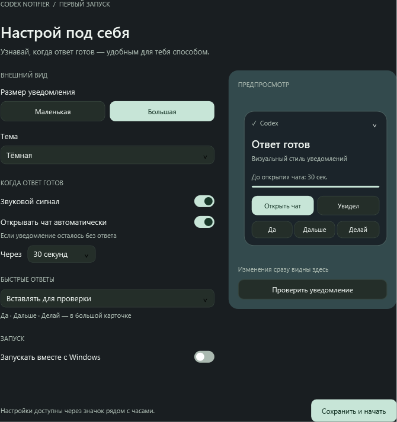
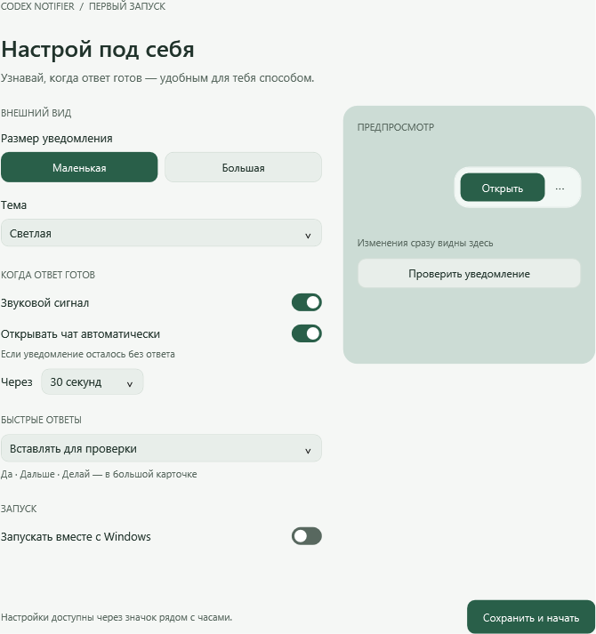

# Codex Notifier

**[English edition for Windows and macOS →](en/README.md)**


Лёгкое настольное приложение, которое напоминает о завершении ответа в **Codex** и помогает быстро вернуться к задаче. Нативные версии для Windows и macOS, без Electron и собственного сервера.

> Companion for the Codex desktop app: completion alerts, quick replies, native Windows/macOS UI and system theme support.

## Как выглядит

Снимки интерфейса Windows. На macOS используется нативный интерфейс AppKit и SwiftUI с теми же настройками.

### Тёмная тема и большая карточка



### Светлая тема и маленькая карточка



## Что умеет

- Показывает уведомление и воспроизводит звук после завершения локальной задачи.
- Маленькая карточка содержит только **«Открыть»** и **⋯**. Три точки раскрывают большую карточку с названием задачи, отсчётом и быстрыми ответами.
- Может автоматически открыть задачу через 15, 30 или 60 секунд. Кнопка **«Увидел»** отменяет открытие.
- Быстрые ответы **«Да»**, **«Дальше»**, **«Делай»**: вставить черновик для проверки или отправить сразу после проверки поля ввода.
- Подстраивается под светлую или тёмную тему устройства; тему можно выбрать вручную.
- Открывает настройки при первом запуске. Автозапуск включается по желанию.
- Работает в трее Windows или строке меню macOS.

## Как это работает

1. Приложение запоминает текущие позиции в локальных журналах `~/.codex/sessions`, чтобы не показывать старые завершения.
2. Системные уведомления об изменении файлов запускают чтение новых строк JSONL. Событие `task_complete` ставит уведомление в очередь; новый `task_started` отменяет ожидающее уведомление этой задачи.
3. Название задачи берётся из `~/.codex/session_index.jsonl`.
4. Кнопка открытия использует ссылку `codex://threads/<id>`. На Windows восстановление окна выполняется только для свёрнутого окна, чтобы сохранять развёрнутое состояние.
5. Быстрый ответ использует заполнение поля ввода через ссылку Codex. На Mac запись через Accessibility разрешается только в пустой редактор. На Windows проверяется сохранённый черновик; файл может отставать от ещё не сохранённого ввода. Перед автоматической отправкой проверяются текст, фокус и отсутствие нового ввода пользователя; повторной автоматической отправки нет.

Утилита не требует API-ключа и не загружает историю разговоров на собственный сервер. Быстрый ответ передаётся установленному приложению Codex; далее его обрабатывает Codex обычным способом.

## Скачать исходники и запустить

На GitHub выберите **Code → Download ZIP**, распакуйте архив и следуйте инструкции своей платформы. Репозиторий содержит исходники; готовые подписанные установщики не включены.

### Windows

Нужен Windows с .NET Framework 4.x и WPF. В PowerShell из корня проекта:

```powershell
.\windows\build.ps1
.\windows\CodexNotifier.exe
```

При первом запуске выберите параметры и нажмите **«Сохранить и начать»**. Настройки доступны также через значок в трее.

[Подробная инструкция Windows](windows/README.md)

### macOS

Нужны **macOS 13+ и Xcode** с выбранными Command Line Tools. В Terminal из корня проекта:

```bash
bash macos/Build.command
```

Скрипт собирает универсальное приложение для Apple Silicon и Intel, выполняет встроенную проверку и показывает результат в Finder. Перенесите `macos/build/Codex Notifier.app` в **Applications** и запустите.

На Mac для надёжной вставки и автоматической отправки требуется разрешение Accessibility. Для локальной сборки используется ad hoc подпись; приложение не нотарифицировано Apple.

[Подробная инструкция macOS](macos/README.md)

## Производительность

На Windows используются C#, WinForms для трея и WPF для интерфейса; на macOS — Swift, AppKit и SwiftUI. Изменения журналов отслеживаются через FileSystemWatcher, FSEvents и vnode-наблюдатели. История не перечитывается целиком по постоянному таймеру, длинные строки и накопленные события ограничены.

После оптимизации Windows-версия на компьютере разработки занимала около **39 МБ рабочей памяти в простое** после запуска. После открытия интерфейса расход выше. Это наблюдение на одном устройстве, а не гарантированный лимит. На Mac финальная сборка показала около 31 МБ RSS и 0% CPU в коротком измерении простоя.

## Статус и ограничения

| Платформа | Проверено |
| --- | --- |
| Windows | Сборка и запуск; 24 проверки логики и 28 проверок настроек/интерфейса |
| macOS | Universal-сборка, подпись, 22 теста; реальные уведомления и оба режима ответов на Mac проверены |

- Это помощник для **локальных задач приложения Codex**. Облачные чаты ChatGPT и запросы подтверждения посреди выполнения не отслеживаются.
- Уведомление появляется на каждое завершение ответа; смысл ответа и необходимость действия пользователя не анализируются.
- Формат журналов и ссылки Codex могут меняться после обновлений.
- Отправка быстрых ответов на Windows подтверждена двумя реальными отправлениями до дополнительных исправлений аудита. На Mac вставка и автоотправка подтверждены в изолированной тестовой задаче. Рекомендуемый начальный режим — черновик для проверки; он выбран по умолчанию.
- Если проверка поля ввода или фокуса не проходит, отправьте текст вручную. На Mac используется проверенный AX fallback для пустого редактора, если ссылка не вставляет текст.
- Переключение фокуса и полноэкранных пространств зависит от операционной системы; показ уведомления поверх fullscreen подтверждён на тестовом Mac.

## Структура проекта

```text
windows/    C#, XAML, скрипт сборки и проверки
macos/      Swift, Info.plist и универсальная сборка для Mac
```

Локальные настройки хранятся в `%LOCALAPPDATA%\CodexNotifier` на Windows и `~/Library/Application Support/CodexNotifier` на macOS. Журналы чатов и пользовательские настройки в репозиторий не включены.

Независимый проект, не официальный продукт OpenAI.

## Аудит

Результаты проверок и непроверенные сценарии описаны в [AUDIT.md](AUDIT.md). Для повторной проверки Windows запустите windows/verify.ps1.

Проверенная Mac-версия и оставшиеся ограничения: [отчёт Mac](macos/TEST_REPORT.md).
