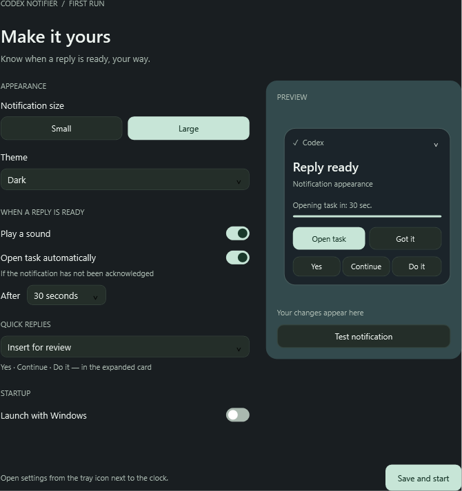
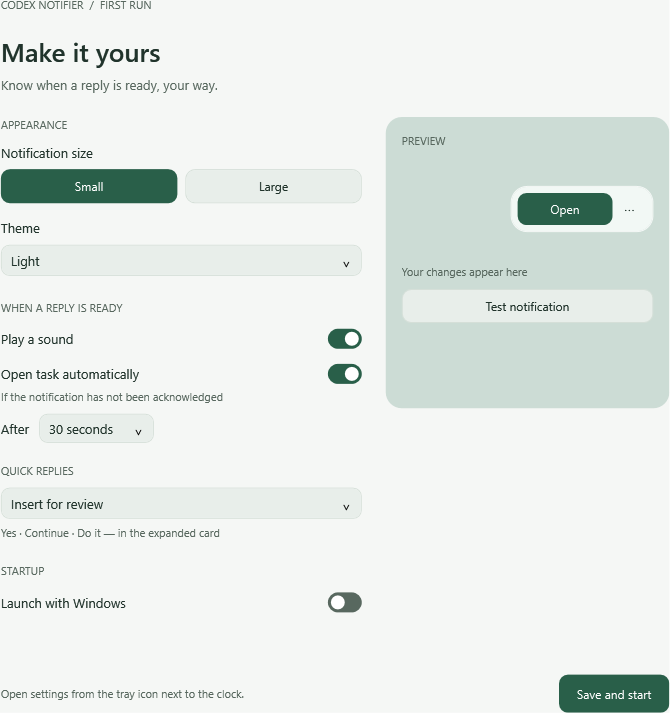

# Codex Notifier — English edition

**Background quick replies:** Send immediately now uses `codex queue`, without showing the app or changing its draft. Requires a Codex CLI version with the `queue` command. Failure never opens the app or retries automatically. Insert for review still opens the editor. Disable automatic opening to open tasks only with the Open button.

[Русская версия](../README.md)

A lightweight desktop companion that tells you when a local **Codex** task has finished responding, so you can return and take the next step. Native Windows and macOS apps, without Electron or a separate server.

## Get started

- **Windows:** follow the [Windows build and launch instructions](windows/README.md).
- **macOS:** follow the [Mac build and launch instructions](macos/README.md).

This folder contains the English application sources for both platforms. The Russian edition remains in the repository's top-level `windows` and `macos` folders. Both editions use the same settings and application identity: quit the current edition before switching languages. Existing task titles retain their original language.

## Features

- The notification hides after 15 seconds. The configured automatic task-opening timer continues independently.
- A small notification with **Open** and **⋯**, or an expanded card with the task title and actions.
- Light, dark, or system appearance; a custom tray/menu bar icon.
- Optional sound and automatic task opening after 15, 30, or 60 seconds.
- **Got it** dismisses the notification and cancels automatic opening.
- Quick replies: **Yes**, **Continue**, and **Do it**. Choose **Insert for review** or **Send immediately**. Insertion is the default.
- First-run settings, live preview, test notification, pause, and optional launch at login.

## Screenshots

Actual English Windows settings; macOS uses native SwiftUI controls.

## How it works

The app watches new events in local `~/.codex/sessions` files and reads task names from Codex's local index. Previously completed responses are ignored at startup. Notifications are queued when several tasks finish. File change notifications and bounded queues keep background work small; no language model runs inside this utility.

Insert for review opens the task editor. Send immediately queues the message directly for the matching task through Codex CLI, without opening a window or editing a draft. A successful queue request confirms acceptance, not completion of the response. An uncertain result is never retried automatically.

## Scope and limitations

This is an independent companion for **Codex desktop local tasks**. It does not monitor general ChatGPT web/cloud conversations or permission requests in the middle of a task. It detects completed responses, whether or not they ask a question. Codex updates can change log formats, deep links, or editor accessibility. macOS draft insertion requires Accessibility permission; background sending does not.

The English Windows edition passes 27 core checks and 28 UI checks. See platform instructions for repeatable verification. macOS requires a native Mac build; its build script compiles both Apple Silicon and Intel executables and runs core checks.
